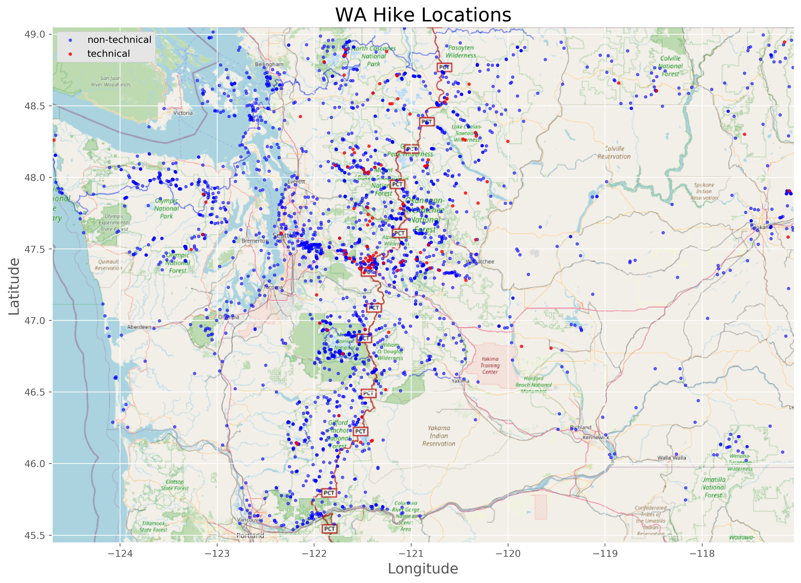

# Washington Hiking Popularity

<p align="left">

|

</p>

<div align="left">
<a href="https://github.com/redwin21">Eddie Ressegue</a>
</div>


---

Seattlites pride themselves on their outdoor excursions. You'd be hard-pressed to find someone who didn't enjoy hiking. Washington Trails Association provides a [website](wta.org) for people to find information on hikes and discover new ones.

With the hiking community so large in the Pacific Northwest, there's a strong market for outdoor sports gear. Imagine being a gear retailer, trying to find out how to target new customers, update products and create new ones.

With hiking being so popular, there are constants efforts made to build new trails, maintain current trails, and rescue estranged hikers who lose their way. Information on why a hike is so popular can help focus resources to the best locations. It can also be used for developing new hikes in places outside of Washington.

The following models, and overall study, are meant to provide insight into what makes a hike so popular. Feature importance can be extracted from models that make predictions on popularity quanitities to draw these insights.

---

## Table of Contents

- <a href="https://github.com/redwin21/wa-hiking-guide#hiking-data-collection-and-cleaning">Hiking Data Collection and Cleaning</a>
- <a href="https://github.com/redwin21/wa-hiking-guide#hike-description-language-processing">Hike Description Language Processing</a>  
- <a href="https://github.com/redwin21/wa-hiking-guide#models">Models</a> 
    - <a href="https://github.com/redwin21/wa-hiking-guide#linear-regression-model">Linear Regression Model</a> 
    - <a href="https://github.com/redwin21/wa-hiking-guide#ridge-regression-model">Ridge Regression Model</a> 
    - <a href="https://github.com/redwin21/wa-hiking-guide#gradient-boosting-regression-model">Gradient Boosting Regression Model</a>  
- <a href="https://github.com/redwin21/wa-hiking-guide#results">Results</a>  
- <a href="https://github.com/redwin21/wa-hiking-guide#next-steps">Next Steps</a>  

---

## Data Collection and Processing

## Hiking Data Collection and Cleaning

The data for this project is collected from [Washington Trails Association](https://www.wta.org/) (WTA), a database for hikes and trip reports in Washington state.

A dataset of all of the hikes on the website, as well as urls to those hikes, can be found in a [data.world](https://data.world/nick-hassell/washington-state-hiking-trails) database. This dataset provided a prelimiary set of data, as well as an easy way to access all of the hike web pages.

The data was collected by visiting each of the urls in the original dataframe and scraping the html. More details can be found in the [data](https://github.com/redwin21/wa-hiking-guide/tree/master/data) folder.


<details>
<summary> Data Features </summary>
A snippet of the final dataframe information can be seen here:

```
<class 'pandas.core.frame.DataFrame'>
RangeIndex: 3412 entries, 0 to 3411
Data columns (total 37 columns):
 #   Column                                                     Non-Null Count  Dtype  
---  ------                                                     --------------  -----  
 0   name                                                       3412 non-null   object 
 1   url                                                        3412 non-null   object 
 2   length                                                     2193 non-null   float64
 3   highest point                                              1746 non-null   float64
 4   gain                                                       2043 non-null   float64
 5   lat                                                        2519 non-null   float64
 6   lon                                                        2519 non-null   float64
 7   pass: Discover Pass                                        3412 non-null   int64  
 8   pass: National Monument Fee                                3412 non-null   int64  
 9   pass: National Park Pass                                   3412 non-null   int64  
 10  pass: None                                                 3412 non-null   int64  
 11  pass: Northwest Forest Pass                                3412 non-null   int64  
 12  pass: Sno-Parks Permit                                     3412 non-null   int64  
 13  pass: Wilderness Permit                                    3412 non-null   int64  
 14  Wildflowers/Meadows                                        3412 non-null   float64
 15  Dogs allowed on leash                                      3412 non-null   float64
 16  Good for kids                                              3412 non-null   float64
 17  Lakes                                                      3412 non-null   float64
 18  Fall foliage                                               3412 non-null   float64
 19  Coast                                                      3412 non-null   float64
 20  Mountain views                                             3412 non-null   float64
 21  Wildlife                                                   3412 non-null   float64
 22  Old growth                                                 3412 non-null   float64
 23  Summits                                                    3412 non-null   float64
 24  Ridges/passes                                              3412 non-null   float64
 25  Established campsites                                      3412 non-null   float64
 26  Waterfalls                                                 3412 non-null   float64
 27  Rivers                                                     3412 non-null   float64
 28  rating                                                     3251 non-null   float64
 29  votes                                                      3251 non-null   float64
 30  reports                                                    3251 non-null   float64
 31  description                                                3251 non-null   object 
 32  drive distance                                             2031 non-null   float64
 33  drive time                                                 2031 non-null   float64
dtypes: float64(27), int64(7), object(3)
memory usage: 986.4+ KB
```

The meanings of the features are the following:

- length: hike length in miles
- highest point: max elevation of the hike in feet
- gain: elevation gain of the hike in feet
- lat: latitude of the hike
- lon: longitude of the hike
- pass: each of these features is binary (1 = True, 0 = False) whether this parking pass is required
- Dogs allowed on leash - Rivers: each of these features is binary (1 = True, 0 = False) whether this feature is present on this hike
- rating: 0-5 star rating of the hike
- votes: number of ratings for the hike
- reports: number of trip reports written for the hike
- description: text description of the hike
- drive distance: miles required to drive from Seattle to the hike
- drive time: minutes required to drive from Seattle to the hike
</details>

Two features of the data were identified as being related to popularity. These are `reports` and `rating`. Reports is a number that indicates how many trip reports have been written for a hike, related to how frequently a hike is visited. Rating is a 0-5 number that indicates hikers' favorability of the hike based on an aggregate of votes from the website's users. These two features are the focus of the machine learning predictions.

---

## Hike Description Language Processing

Among the data collected from WTA was the hike description, which provided a source for seeking out latent features of the data. Some natural language processing was performed to identify different features hidden in the text.

First, the text was vectorized, removing stopwords and creating term frequency matrices. Two processes approaches were taken to attempt to extract information from the text. A non-negative matrix factorization (NMF) was used to determine the most important latent features, and identify the associated words. Similarly, a K-Means clustering was done to group similar words and hikes together. Both produced similar results.

In just two clusters, and with a little bit of domain knowledge, one can clearly distinguish the different features in the text:

```
['required' 'trail' 'gear' 'experience' 'park' 'peak' 'area' 'scramble' 'summit' 'expertise' 'finding' 'route' 'trails' 'mountain' 'climbing']

['trail' 'lake' 'creek' 'miles' 'mile' 'road' 'hike' 'mountain' 'forest' 'views' 'river' 'ridge' 'feet' 'way' 'trailhead']
 ```

 In this case, the first one refers to technical hiking, indicated by words like "climbing", "expertise", "gear", etc. The other cluster seems to lump together everything else.

 All number of clusters for K-Means and factors for NMF provided similar results, where one category clearly identified techncial hiking, and the others were not distinguishable. Silhouette graphs of two different clusterings show this effect (with silhouette score being a measure of how appropriately grouped a data point is within a cluster). One cluster (the "technical" grouping) has a high positive score, meaning the data point is close to the center of the cluster, while all other clustered data points are negative. Five clusters for the second graph was arbitrarily chosen to highlight the affect.


<summary> Silhouette Graphs </summary>
<p align="center">

</p>


This latent feature in the text was added to the data frame as a new feature called `technical`, hopefully to add additional insights to the predictions.

Here is a plot of hikes on a map of Washington by location, distinguished by whether they are "technical" or not, as determined by the natural language processing.

<p align="center">

</p>

---

## Models

Three models were considered in making predictions of reports and rating: an ordinary least squares linear regression, a ridge regression, and a gradient boosting regression.

---

### Linear Regression Model

An ordinary least squares linear regression model was used to attempt to predict hike reports and rating features. The model was built with the `statsmodels` python library. The goal of the model was to extrect feature coefficients to gain some insight into which are important for the model. Most importanly, identifying the sign and p-value of the coefficients would identify which features were effective in the model and for which direction.

This table summarizes the coefficients and p-values from the models for the prediction of reports and rating, respectively.

| feature                     | reports coef | reports p-value | rating coef | rating p-value |
|-----------------------------|--------------|-----------------|-------------|----------------|
| length                      | -2.5306      | 0.000           | -0.0068     | 0.189          |
| highest point               | 0.0026       | 0.358           | 0.0004      | 0.000          |
| gain                        | 0.0166       | 0.002           | 4.408e-05   | 0.264          |
| pass: Discover Pass         | -12.1523     | 0.510           | 0.6403      | 0.000          |
| pass: National Monument Fee | 157.6036     | 0.226           | 0.0974      | 0.921          |
| pass: National Park Pass    | -8.1689      | 0.692           | 0.2422      | 0.120          |
| pass: Northwest Forest Pass | 44.2028      | 0.000           | 0.1432      | 0.129          |
| pass: Sno-Parks Permit      | -52.6537     | 0.165           | -0.2988     | 0.296          |
| pass: Wilderness Permit     | -79.4980     | 0.665           | -0.1061     | 0.939          |
| Wildflowers/Meadows         | 20.4010      | 0.084           | 0.2393      | 0.007          |
| Dogs allowed on leash       | 14.0731      | 0.247           | 0.1298      | 0.157          |
| Good for kids               | 44.0796      | 0.001           | 0.9019      | 0.000          |
| Lakes                       | 49.0096      | 0.000           | 0.3407      | 0.000          |
| Fall foliage                | 21.3554      | 0.152           | -0.0167     | 0.882          |
| Coast                       | 39.6841      | 0.137           | 1.7666      | 0.000          |
| Mountain views              | 46.7921      | 0.000           | 0.2181      | 0.020          |
| Wildlife                    | -12.1101     | 0.307           | 0.2309      | 0.010          |
| Old growth                  | 21.0239      | 0.094           | 0.3401      | 0.000          |
| Summits                     | 35.6294      | 0.018           | 0.1096      | 0.333          |
| Ridges/passes               | -7.3388      | 0.606           | -0.1032     | 0.337          |
| Established campsites       | 30.2489      | 0.032           | -0.1050     | 0.323          |
| Waterfalls                  | 134.2133     | 0.000           | 0.5784      | 0.000          |
| Rivers                      | 12.3975      | 0.323           | 0.5532      | 0.000          |
| drive time                  | -0.0765      | 0.003           | 0.0008      | 0.000          |
| technical                   | -5.7098      | 0.834           | -0.6192     | 0.003          |

This model identifies that some features are more important than others via the magnitude of the coefficients. More importantly, the sign of the coefficients indicates teh direction of their effect. For instance, waterfalls on a hike have a large positive affect, while certian parking passes and the hike being technical make a hiker less likely to travel there.

---

## Ridge Regression Model

<details>
<summary> Title </summary>

test
</details>

---

## Gradient Boosting Regression Model

<details>
<summary> Title </summary>

test
</details>

---

## Results

---

## Next Steps

With updates to the data and soem additional analysis, a next step for this project would be to create a hiking recommender. The recommender would act in real time to determine the best hike for a person at a certain time. It would have the following attributes:

- draw overall insights from all previous trip reports to include user sentiment about a hike and determine the best times of year
- pull the latest trip reports and perform sentiment analysis to determine if hiking conditions are currently good
- draw on the current weather forecast to determine if the weather will be appropriate at a given hike

---

